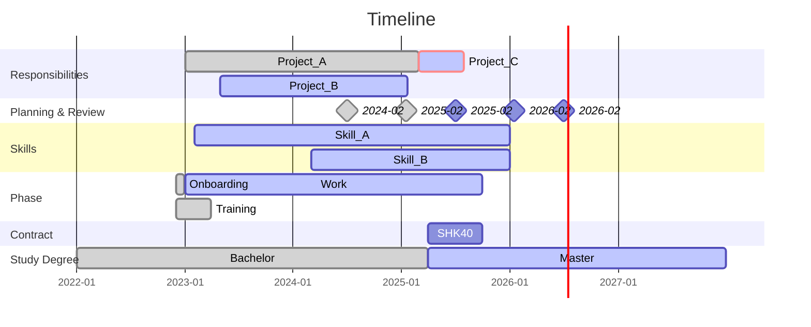

# agenda_template

## Roadmap

<!-- 

## Completed
## Accomplishments

- 📝 GitBots published in JIT
- 🏅 Best paper prize for GitBots
- 👨‍🏫 Teaching assistant for OSP (SuSe2025)
- 📢 Presented GitBots at ICIS
- 🛠️ Published Python library
- 💰 Raised funding for conference
- 🎓 Completed Master's thesis

## Log of objectives and key results

During the planning and review session, we assess accomplishment of results based on a scale of three:
🟢 70-100% 
🟡 40-60%
🔴 0-30%
-->

## Objectives

1. [Project-A](URL): Objective
	- Key result 1
	- Key result 2

2. [Project-B](URL): Objective
	- Key result 1
	- Key result 2

<!-- 
**Upcoming/Waiting**
 -->

## Log

## CW XY
